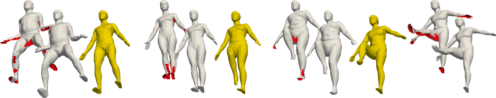

# SAL: Sign Agnostic Learning of Shapes From Raw Data
<p align="center">
  
</p>

This repository contains an implementation to the CVPR 2020 paper SAL: Sign Agnostic Learning of Shapes From Raw Data.

SAL is a deep learning approach for learning implicit shape representations directly from raw, unsigned geometric data, such as point clouds and triangle soups.

The teaser above depicts an example where collectively learning a dataset of raw human scans using SAL overcomes many imperfections and artifacts in the data (left in every gray pair) and provides high quality surface reconstructions (right in every gray pair) and shape space (interpolations of latent representations are in gold).

For more details visit: https://arxiv.org/abs/1911.10414.

### Installation Requirmenets
The code is compatible with python 3.7 and pytorch 1.2. In addition, the following packages are required:  
pyhocon, plotly, scikit-image, trimesh, GPUtil, tqdm, CGAL.

### Usage
#### Learning shape space from the D-Faust dataset raw scans

##### Data
The raw scans can be downloaded from http://dfaust.is.tue.mpg.de/downloads.
In order to be able to run the training process, the raw scans need to be preprocessed using:

```
cd ./code
python preprocess/preprocess_dfaust.py 
```

##### Predicting meshed surfaces with SAL trained network
We have uploaded SAL trained networks. To produce predictions on unseen test scans, run:
```
cd ./code
python evaluate/evaluate.py --checkpoint 2000 --parallel --exp_name dfaust --conf ./confs/dfaust.conf --split ./confs/splits/dfaust/test_all_every5.json --exps_dir trained_models
```

Notice that it also possible to compute the chamfer distance to registrations and input scan using the --compute_dist_to_gt flag.

##### Training
If you want to train SAL yourself, run:
```
cd ./code
python training/exp_runner.py
```

#### Surface reconstruction
SAL can also be used to reconstruct a single raw 3D data such as a point cloud or a triangle soup. Update the file ./confs/recon.conf to point to the path of your input raw 3D data:
```
train
{
  ...
  dataset_path = your_path
  ...
}
```
Then, run training:
```
cd ./code
python training/exp_runner.py --batch_size 1 --conf ./confs/recon.conf --workers 1 
```
Finally, to produce the meshed surface, run:
```
cd ./code
python evaluate/evaluate.py --exp_name recon --conf ./confs/recon.conf --split none
```

### Citation
If you find our work useful in your research, please consider citing:

       @InProceedings{Atzmon_2020_CVPR,
		author = {Atzmon, Matan and Lipman, Yaron},
		title = {SAL: Sign Agnostic Learning of Shapes From Raw Data},
		booktitle = {IEEE/CVF Conference on Computer Vision and Pattern Recognition (CVPR)},
		month = {June},
		year = {2020}
		}
		
### Related papers
* [Atzmon & Lipman. - SAL++: Sign Agnostic Learning with Derivatives (2020)](https://arxiv.org/abs/2006.05400)
* [Gropp et al. - Implicit Geometric Regularization for Learning Shapes (2020)](https://arxiv.org/abs/2002.10099)
* [Atzmon et al. - Controlling Neural Level Sets (2019)](https://arxiv.org/abs/1905.11911)
	
